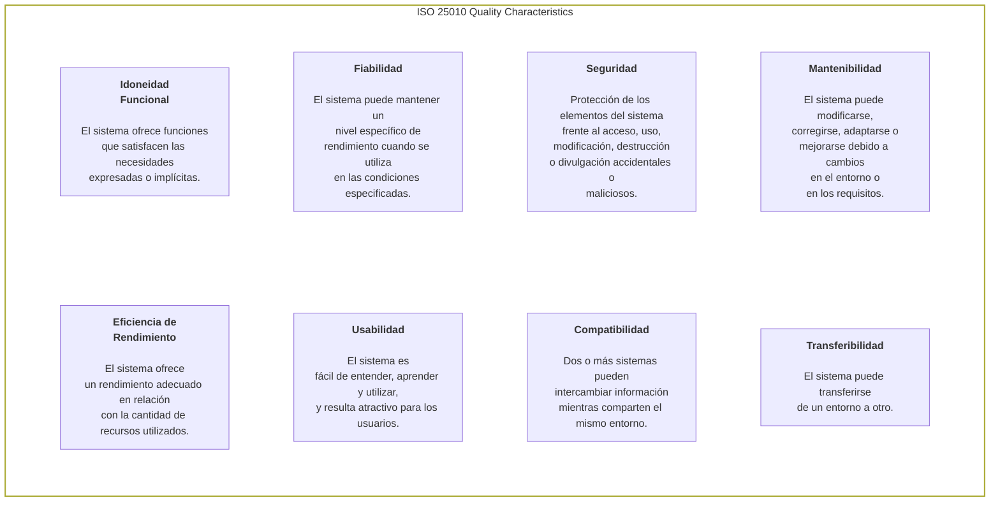

# Arquitectura

Este documento constituye el borrador técnico para la documentación de la arquitectura del software, basándonos en el estándar internacional **arc42**.

> **Introducción y Metas**
>
> Link de referencia: https://docs.arc42.org/section-1/

## 1. Introducción y Metas

Describe los requisitos pertinentes y los factores determinantes que deben tener en cuenta los arquitectos de software y el equipo de desarrollo. Entre ellos se incluyen:
- los objetivos empresariales subyacentes, las características esenciales y los requisitos funcionales del sistema,
- los objetivos de calidad de la arquitectura,
- las partes interesadas pertinentes y sus expectativas

### 1.1 Visión General de Requisitos

- **Contenido**: Breve descripción de los requisitos funcionales, los factores impulsores y un resumen (o extracto) de los requisitos. Enlaces a los documentos de requisitos (que se espera que existan), con información sobre dónde encontrarlos.
- **Motivación**: Desde el punto de vista de los usuarios finales, un sistema se crea o modifica para mejorar el apoyo a una actividad empresarial y/o mejorar la calidad.
- **Forma**: Breve descripción textual, probablemente en formato de casos de uso tabulares. Si existen documentos de requisitos, esta descripción general debe hacer referencia a dichos documentos.

>Mantenga estos extractos lo más breves posible. Busque un equilibrio entre la legibilidad de este documento y la posible redundancia con respecto a los documentos de requisitos.

### 1.2 Metas Críticas de Calidad

- **Contenido**: Los tres (o como máximo cinco) objetivos de calidad principales de la arquitectura cuyo cumplimiento reviste mayor importancia para las principales partes interesadas. Nos referimos específicamente a los objetivos de calidad de la arquitectura. No hay que confundirlos con los objetivos del proyecto, ya que no son necesariamente idénticos.

> La norma ISO 25010 ofrece una buena visión general de los posibles temas de interés:

- **Motivación**: Debes conocer los objetivos de calidad de tus partes interesadas más importantes, ya que estos influirán en decisiones arquitectónicas fundamentales. Asegúrate de ser muy concreto al describir estas cualidades y evita el uso de palabras de moda. Si tú, como arquitecto, no sabes cómo se evaluará la calidad de tu trabajo…
- **Formato**: Una tabla con los objetivos de calidad más importantes y los escenarios concretos, ordenados por prioridades.

### 1.3 Partes Interesadas

**Contenido**: Descripción detallada de las partes interesadas del sistema, es decir, todas las personas, funciones u organizaciones que:
- deben conocer la arquitectura;
- deben estar convencidas de la arquitectura;
- deben trabajar con la arquitectura o con el código;
- necesitan la documentación de la arquitectura para su trabajo;
- deben tomar decisiones sobre el sistema o su desarrollo.

**Motivación**:
Debes conocer a todas las partes implicadas en el desarrollo del sistema o afectadas por él. De lo contrario, podrías llevarte sorpresas desagradables más adelante en el proceso de desarrollo. Estas partes interesadas determinan el alcance y el nivel de detalle de tu trabajo y sus resultados.

**Formato**:
Tabla con los nombres de los roles, los nombres de las personas y sus expectativas con respecto a la arquitectura y su documentación.

## 2. Restricciones Arquitectónicas

## 3. Alcance y Contexto (Nivel 1 de C4)

### 3.1 Diagrama de Contexto

## 4. Estrategia de la Solución

## 5. Vista de Bloques de Construcción (Niveles 2 y 3 de C4)

### 5.1 Nivel 2: Diagrama de Contenedores

### 5.2 Nivel 3: Componentes de la Web App (Clean Architecture)

## 6. Vista de Tiempo de Ejecución

### 6.1 Ciclo de Vida de una Tarea de Agente

### 6.2 Manejo de Fallos

## 7. Vista de Despliegue

### 7.1 Infraestructura Objetivo

### 7.2 Estrategia de Escalado

## 8. Conceptos Transversales

### 8.1 Persistencia y Consistencia

### 8.2 Seguridad

### 8.3 Observabilidad

## 9. Decisiones Arquitectónicas (ADRs)

## 10. Requerimientos Operacionales Cualitativos

## 11. Riesgos y Deuda Técnica

### 11.1 Riesgos Identificados

### 11.2 Deuda Técnica Asumida

## 12. Glosario

---

 