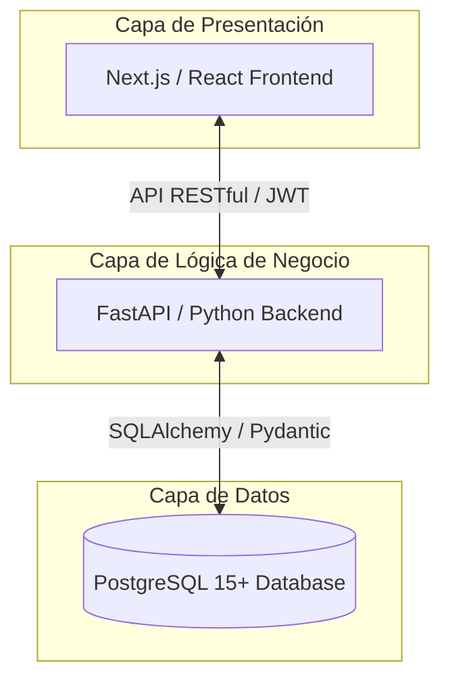

# 2. Arquitectura del Proyecto

GEMA adopta una arquitectura de capas desacopladas que permite el desarrollo, prueba y mantenimiento independiente de cada componente. Esta decisión garantiza que un cambio en el frontend no afecte al backend, y que la base de datos pueda evolucionar sin romper la lógica de negocio.

---

## 2.1. Stack Tecnológico

| Capa | Tecnología | Justificación |
| :--- | :--- | :--- |
| **Frontend** | Next.js (React) | Rendimiento superior con Server Side Rendering. Ideal para paneles de control dinámicos y alta frecuencia de actualización de datos. |
| **Backend** | FastAPI (Python) | Velocidad de desarrollo, tipado con Pydantic para validación automática, documentación Swagger generada automáticamente y soporte asíncrono nativo. |
| **Base de datos** | PostgreSQL 15+ | Soporte para JSONB, integridad referencial robusta y manejo eficiente de relaciones complejas entre activos, repuestos y órdenes de trabajo. |
| **Comunicación** | API RESTful | Interfaz estándar documentada que desacopla el frontend del backend y facilita futuras integraciones con sistemas externos. |
| **Contenedores** | Docker / Compose | Garantiza paridad entre entornos de desarrollo y producción. Cualquier desarrollador levanta el stack completo con un solo comando. |
| **Despliegue** | DigitalOcean Droplet | Balance óptimo entre costo ($6/mes) y capacidad para el MVP. Centraliza frontend, backend y base de datos en un servidor administrable. |
| **Proxy / SSL** | Nginx + Let's Encrypt | Punto de entrada único con HTTPS. Enruta tráfico hacia Next.js y FastAPI sin exponer puertos internos al internet. |
| **CI/CD** | GitHub Actions | Despliegue automático en el Droplet al hacer merge a la rama main. Elimina el proceso manual de actualización del servidor. |

---

## 2.2. Diagrama de Capas

El sistema opera en tres capas claramente separadas comunicadas mediante una API RESTful:

- **Capa de presentación (Next.js)**: Renderiza la interfaz, consume los endpoints del backend y gestiona el estado de la sesión del usuario mediante el token JWT.
- **Capa de lógica de negocio (FastAPI)**: Valida los datos de entrada con Pydantic, aplica las reglas del dominio, verifica los permisos RBAC y se comunica con la base de datos a través de SQLAlchemy.
- **Capa de datos (PostgreSQL)**: Almacena toda la información del sistema con integridad referencial. No está expuesta a internet; solo es accesible por los contenedores internos de Docker.

---

## 2.3. Infraestructura y Despliegue

La infraestructura está completamente definida como código mediante Docker Compose, lo que permite que cualquier desarrollador del equipo levante el stack completo con el comando `docker-compose up` sin configuraciones adicionales.

> [!TIP]
> **Entorno de Desarrollo**  
> Stack completo en Docker con volúmenes montados para hot reload. Base de datos local aislada de producción.

> [!IMPORTANT]
> **Entorno de Producción**  
> Droplet de DigitalOcean (1 GB RAM / 1 vCPU / 25 GB SSD, $6/mes) con imagen Docker preinstalada. Nginx como proxy inverso con HTTPS vía Let's Encrypt.

> [!NOTE]
> **CI/CD y Control de Versiones**  
> - **CI/CD**: GitHub Actions despliega automáticamente al servidor tras cada merge a la rama main, eliminando el proceso manual de actualización.  
> - **Control de Versiones**: Flujo de ramas con develop como rama de integración y main como rama de producción. Pull Requests obligatorios con revisión de líderes de área.

 