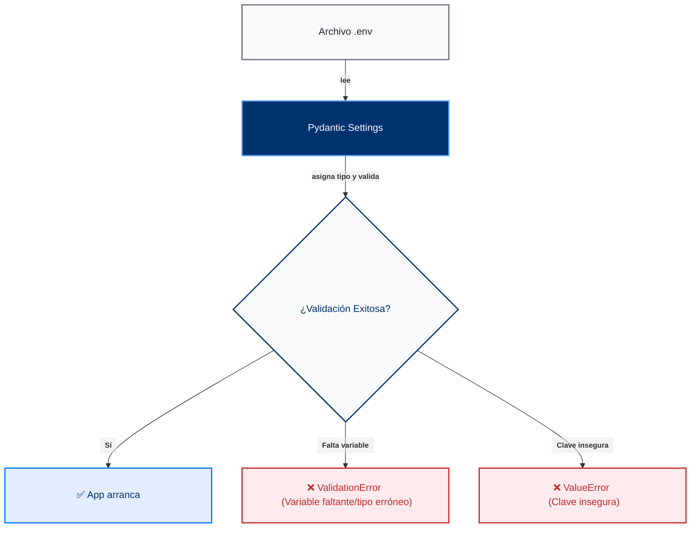

Toda la configuración de la aplicación se lee desde variables de entorno mediante **Pydantic Settings** ([documentación oficial](https://docs.pydantic.dev/latest/concepts/settings/)). El módulo `src/app/infrastructure/config/settings.py` lee los valores, los valida al iniciar y detiene la aplicación si detecta algún error de configuración.

<Callout type="info">

**¿Qué hace Pydantic Settings?** Lee las variables de entorno (o un archivo `.env`), las convierte al tipo de dato de Python correspondiente (`int`, `bool`, `str`) y valida que todas las variables obligatorias estén presentes. Si falta alguna o tiene un formato incorrecto, genera un error detallado antes de que la aplicación intente arrancar.

</Callout>

## Filosofía Twelve-Factor (patrón de configuración)

Este enfoque sigue el principio de configuración de [The Twelve-Factor App](https://12factor.net/es/config), una metodología diseñada en 2011 por Adam Wiggins (cofundador de Heroku) para construir aplicaciones modernas y de alta escalabilidad.

La metodología Twelve-Factor exige una separación estricta entre la configuración y el código base. La configuración abarca todo lo que varía entre despliegues (como desarrollo, preproducción o producción), lo que incluye credenciales, accesos a bases de datos y parámetros del entorno. Al mantener estos valores en variables de entorno y fuera del código, garantizas que la aplicación pueda desplegarse en cualquier entorno sin modificar sus archivos.

El flujo de inicio es el siguiente:



## Inspeccionar la configuración

Puedes ver el estado actual de toda la configuración en tiempo de ejecución con el método `model_dump()` del objeto `settings`:

```python
from app.infrastructure.config.settings import settings

settings.model_dump()
# → {"database_url": "...", "jwt_secret_key": "...", ...}
```

Si solo te interesa una variable en concreto, accede a ella directamente como un atributo del objeto:

```python
settings.JWT_SECRET_KEY   # → "tu-clave"
settings.APP_ENV          # → "development"
```

## Variables de entorno

El sistema utiliza diferentes grupos de variables para gestionar las conexiones y el comportamiento de sus módulos principales. A continuación se detallan cada uno de estos bloques:

### Base de datos

Define la conexión principal con el motor de base de datos relacional:

| Variable | Descripción | Ejemplo |
|----------|-------------|---------|
| `DATABASE_URL` | Cadena de conexión asíncrona para PostgreSQL | `postgresql+asyncpg://sigma:sigma@db:5432/sigma_db` |

### JWT y autenticación

Estas variables configuran la firma, expiración y seguridad de los tokens de acceso del usuario:

| Variable | Descripción | Por defecto |
|----------|-------------|-------------|
| `JWT_SECRET_KEY` | Clave secreta para firmar los tokens. Debe tener al menos 32 caracteres en producción. | — |
| `JWT_ALGORITHM` | Algoritmo de firma del token | `HS256` |
| `JWT_ACCESS_TOKEN_EXPIRE_MINUTES` | Tiempo de vida del token de acceso en minutos | `30` |
| `JWT_REFRESH_TOKEN_EXPIRE_DAYS` | Tiempo de vida del token de refresco en días | `7` |

<Callout type="warn">

En `APP_ENV=production`, la aplicación no arranca si `JWT_SECRET_KEY` coincide con el valor por defecto de desarrollo o tiene menos de 32 caracteres. Este validador de seguridad está definido en `settings.py` mediante `@field_validator`.

</Callout>

### Redis

Redis actúa como lista de bloqueo de tokens revocados (JTI blocklist). Cada entrada expira junto con el token que representa, evitando que la lista crezca sin límite.

| Variable | Descripción | Por defecto |
|----------|-------------|-------------|
| `REDIS_URL` | URL de conexión al servidor de Redis | `redis://redis:6379/0` |

<Callout type="info">

**¿Qué es un JTI?** JTI significa *JWT ID (JSON Web Token Identifier)*. Es un identificador único que lleva cada token y que se guarda en Redis al cerrar sesión. Mientras el JTI esté en la lista, el token se considera inválido aunque su fecha de expiración todavía no haya llegado. Cuando el token vence, el registro expira automáticamente en Redis.

</Callout>

### Aplicación

Controla aspectos globales del servidor FastAPI, los modos de depuración y el cumplimiento de estándares de la API:

| Variable | Descripción | Por defecto |
|----------|-------------|-------------|
| `APP_ENV` | Entorno de ejecución: `development` o `production` | `development` |
| `APP_DEBUG` | Activa los logs de SQL en la consola | `true` |
| `APP_TITLE` | Título del proyecto (aparece en `/docs`) | `SIGMA Backend` |
| `APP_VERSION` | Versión actual de la API | `0.1.0` |
| `STRICT_JSONAPI` | Exige `Content-Type: application/vnd.api+json` en todas las solicitudes | `true` |

<Callout type="info">

**¿Qué es JSON:API?** Es un estándar que define cómo estructurar respuestas y peticiones en una API REST: tipos de recurso, identificadores, relaciones y manejo de errores, todo con un formato consistente. Puedes leer la [especificación completa en jsonapi.org](https://jsonapi.org/).

</Callout>

## Modo de depuración

La variable `APP_DEBUG` controla si la aplicación muestra registros detallados de SQL en la consola.

<Callout type="warn">

`APP_DEBUG=true` activa logs detallados de SQL que pueden exponer datos sensibles si se filtran. En producción este valor debe ser siempre `false`.

</Callout>

## Tipos de variables de entorno

Pydantic Settings convierte los valores del archivo `.env` al tipo de Python que espera cada campo:

| Valor en `.env` | Tipo Python |
|-----------------|-------------|
| `APP_DEBUG=true` | `bool(True)` |
| `APP_DEBUG=false` | `bool(False)` |
| `APP_TITLE=GEMA Backend` | `str` |
| `JWT_ACCESS_TOKEN_EXPIRE_MINUTES=30` | `int` |
| `DATABASE_URL=postgresql://...` | `str` |

Si una variable no se puede convertir al tipo esperado (por ejemplo, asignando un texto donde se espera un número entero), Pydantic lanza un error de validación antes de que la aplicación inicie.

## Acceder a la configuración desde el código

En cualquier parte de la aplicación puedes obtener la instancia de configuración importando el objeto `settings`:

```python
from app.infrastructure.config.settings import settings

# Acceso directo a cualquier variable
db_url = settings.DATABASE_URL
debug = settings.APP_DEBUG
```

Puedes usar `model_dump()` si necesitas la configuración completa como diccionario, o bien `model_dump_json()` si la requieres serializada en formato JSON.

## Seguridad del archivo `.env`

El archivo `.env` contiene credenciales y claves secretas de tu aplicación. Te recomendamos seguir estas reglas para asegurar su correcto uso:

- **Evita versionar el archivo:** El archivo `.env` se encuentra en `.gitignore` y nunca debe registrarse en el control de versiones. Cada desarrollador debe mantener su propia copia local.
- **Utiliza la plantilla base:** Copia el archivo `.env.example` provisto en el repositorio para crear tu archivo `.env` inicial:
  ```bash
  cp .env.example .env
  ```
- **Soporte para múltiples entornos:** Puedes configurar archivos específicos como `.env.development` o `.env.production`. El sistema cargará el archivo adecuado en función del valor de la variable `APP_ENV`.

## Comportamiento de `extra="forbid"`

La configuración del modelo de Settings tiene habilitada la opción `extra="forbid"`. Esto significa que cualquier variable en tu archivo `.env` que no esté declarada en `settings.py` causará un fallo al iniciar la aplicación. De esta forma, se evitan errores tipográficos que podrían pasar desapercibidos.

Por ejemplo, si escribes `DATABSE_URL` en lugar de `DATABASE_URL`, la aplicación fallará de inmediato con un error explícito, evitando que el servidor inicie con una configuración errónea.

## Logging estructurado

El módulo `src/app/infrastructure/config/logger.py` configura [Structlog](https://www.structlog.org/) según el valor de `APP_ENV`:

- En **desarrollo** muestra registros con color y formato legible en consola.
- En **producción** emite JSON estricto, listo para enviarse a tus sistemas de observabilidad (como Loki, Datadog o CloudWatch).

Ambas configuraciones capturan los registros de Uvicorn, SQLAlchemy y Alembic bajo el mismo sistema, por lo que no necesitas configurar nada adicional para verlos.

<Callout type="info">

**¿Qué es el logging estructurado?** En lugar de emitir líneas de texto libre como `"Usuario creado: juan@sigma.com"`, Structlog emite objetos con campos clave-valor: `{"event": "user_created", "email": "juan@sigma.com", "level": "info"}`. Así los sistemas de monitoreo pueden filtrar, agrupar y alertar sobre campos concretos sin necesidad de parsear texto.

</Callout>

## Solución de problemas comunes

Aquí tienes una lista de los errores más comunes relacionados con la configuración y cómo solucionarlos:

| Error | Causa probable | Solución |
|-------|----------------|----------|
| `ValidationError: DATABASE_URL` | Variable faltante en `.env` | Copia `.env.example` a `.env`. |
| `ValueError: clave insegura` | `JWT_SECRET_KEY` < 32 caracteres en producción | Genera una clave segura con `openssl rand -hex 32`. |
| `extra="forbid": DATABSE_URL` | Error tipográfico en el nombre de variable | Revisa las mayúsculas y la ortografía. |
| `ModuleNotFoundError: pydantic` | Dependencias no instaladas | Ejecuta `poetry install`. |
| `ConnectionError: Redis` | Redis no está accesible | Verifica que `REDIS_URL` apunte al servidor correcto. |

## Próximos pasos

Una vez configurado el proyecto, puedes avanzar con los siguientes temas:

| Si quieres... | Sigue esta guía |
|---------------|-----------------|
| Ver la estructura del proyecto | [Estructura de directorios](./directory-structure) |
| Conocer las convenciones de código | [Guía de estilo](./style-guide) |
| Diferencias entre entornos | [Entornos](./environments) |
| Entender el flujo de la aplicación | [Ciclo de vida de la aplicación](../architecture/request-lifecycle) |