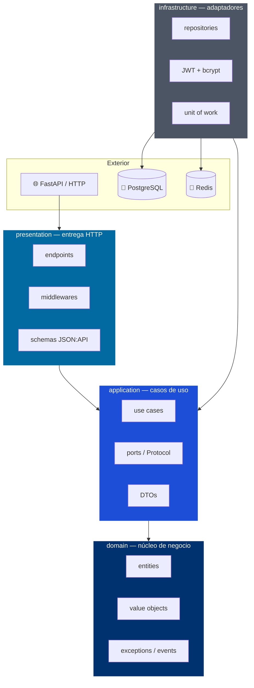

GEMA Backend organiza su código fuente siguiendo los principios de la arquitectura hexagonal (también conocida como puertos y adaptadores). Esta estructura separa claramente la lógica de negocio de los detalles técnicos, permitiendo que el núcleo de la aplicación permanezca independiente de frameworks, bases de datos o servicios externos.

Este diseño comparte los principios fundamentales de la [Clean Architecture](https://blog.cleancoder.com/uncle-bob/2012/08/13/the-clean-architecture.html), asegurando que los cambios en las herramientas tecnológicas no afecten las reglas de negocio de tu sistema.

> [!NOTE]
> **¿Qué es la arquitectura hexagonal?** Aísla la lógica de negocio de los detalles técnicos. La capa del dominio (`domain`) no importa nada de la infraestructura (`infrastructure`); únicamente define contratos que la infraestructura implementa. Esto te permite cambiar de base de datos, de framework HTTP o de proveedor de autenticación sin modificar la lógica de negocio.

## Árbol de directorios

A continuación se presenta la estructura completa del proyecto en su raíz y dentro de la carpeta principal de código fuente:

```
unegia-sigma-backend/
├── src/
│   └── app/
│       ├── domain/                   # Núcleo de negocio, sin dependencias externas
│       │   ├── entities.py           # Entidades con comportamiento y reglas de negocio
│       │   ├── value_objects.py      # Objetos de valor inmutables (Email, UserId...)
│       │   ├── exceptions.py         # Jerarquía de excepciones del dominio
│       │   └── events.py             # Eventos de dominio inmutables
│       │
│       ├── application/              # Casos de uso y contratos (puertos)
│       │   ├── ports/
│       │   │   ├── repository.py     # UserRepositoryPort (Protocol)
│       │   │   ├── auth.py           # PasswordHasherPort, TokenServicePort
│       │   │   └── unit_of_work.py   # UnitOfWorkPort (async context manager)
│       │   ├── use_cases/
│       │   │   ├── register_user.py
│       │   │   ├── login_user.py
│       │   │   ├── refresh_token.py
│       │   │   ├── logout_user.py
│       │   │   └── get_current_user.py
│       │   └── dtos.py               # DTOs de entrada y salida (dataclasses puros)
│       │
│       ├── infrastructure/           # Adaptadores: base de datos, seguridad, caché
│       │   ├── config/
│       │   │   ├── settings.py       # Pydantic Settings con validación estricta
│       │   │   └── logger.py         # Structlog: JSON en prod, consola en dev
│       │   ├── db/
│       │   │   ├── base.py           # DeclarativeBase compartida para evitar ciclos
│       │   │   ├── session.py        # AsyncEngine y async_sessionmaker
│       │   │   └── models.py         # Modelos ORM de SQLAlchemy 2.0
│       │   ├── repositories/
│       │   │   └── user_repository.py  # SqlAlchemyUserRepository
│       │   ├── cache/
│       │   │   └── redis.py          # Cliente global asíncrono de Redis
│       │   ├── security/
│       │   │   ├── jwt.py            # PyJwtTokenService con Redis blocklist
│       │   │   └── hashing.py        # BcryptPasswordHasher
│       │   └── uow.py                # SqlAlchemyUnitOfWork
│       │
│       ├── presentation/             # Capa de entrada: FastAPI, schemas, middlewares
│       │   ├── api/
│       │   │   └── v1/
│       │   │       ├── endpoints/
│       │   │       │   ├── auth.py   # POST /register, /login, /refresh, /logout, GET /me
│       │   │       │   └── health.py # GET /health/live, /health/ready
│       │   │       ├── schemas/
│       │   │       │   ├── jsonapi_base.py  # ResourceIdentifier, ErrorObject...
│       │   │       │   └── auth.py          # TokenDocument, UserDocument, Requests...
│       │   │       └── router.py     # v1_router con prefijo /v1
│       │   ├── exception_handlers.py # Mapeo excepción → HTTP + JSON:API
│       │   └── middlewares/
│       │       ├── request_id.py     # Inyecta X-Request-ID en cada solicitud
│       │       ├── content_type.py   # Valida Content-Type: application/vnd.api+json
│       │       ├── accept.py         # Valida header Accept (406 si incompatible)
│       │       └── rate_limit.py     # Rate limiting atómico con script Lua en Redis
│       │
│       ├── composition/
│       │   └── container.py          # Raíz de composición: factories con Depends()
│       │
│       └── main.py                   # Punto de entrada: lifespan, middlewares, routers
│
├── migrations/                       # Revisiones de Alembic
│   ├── env.py
│   ├── script.py.mako
│   └── versions/
│
├── tests/
│   ├── unit/
│   ├── integration/
│   └── e2e/
│
├── Dockerfile
│   └── ...
```

## El directorio raíz

El directorio raíz de la aplicación contiene la configuración general del entorno, las definiciones de dependencias de Python y los archivos necesarios para el despliegue con Docker.

- **`migrations/`**: Contiene las migraciones de la base de datos gestionadas por Alembic. Aquí se registran los cambios históricos del esquema de la base de datos.
- **`tests/`**: Alberga las pruebas automatizadas del sistema, divididas en pruebas unitarias (`unit`), de integración (`integration`) y de extremo a extremo (`e2e`).
- **`Dockerfile` y `docker-compose.yml`**: Definen la construcción de la imagen de producción y la orquestación de los servicios locales (base de datos, caché y aplicación).
- **`poetry.lock` y `pyproject.toml`**: Archivos de configuración de Poetry que especifican y bloquean las dependencias del proyecto.
- **`alembic.ini`**: Archivo de configuración para Alembic y sus tareas de migración.
- **`.env.example`**: Plantilla con las variables de entorno necesarias para ejecutar el proyecto en desarrollo.

## El directorio de la aplicación (src/app)

La carpeta `src/app` es el núcleo de tu aplicación. Todo el código fuente del backend se encuentra dentro de este directorio, estructurado en cuatro capas de arquitectura hexagonal:

### Capa de dominio (domain)

La capa de dominio representa el corazón de la lógica de negocio. No contiene dependencias de librerías de infraestructura (como SQLAlchemy o Redis) ni frameworks (como FastAPI). Aquí se definen las reglas que rigen el negocio:

- **`entities.py`**: Contiene las entidades del dominio con su propio comportamiento y lógica de validación interna.
- **`value_objects.py`**: Alberga objetos inmutables que representan conceptos del negocio mediante valores (como un identificador de usuario o un correo electrónico).
- **`exceptions.py`**: Define la jerarquía de excepciones propias del negocio.
- **`events.py`**: Contiene los eventos inmutables que se disparan cuando ocurren cambios significativos en el dominio.

### Capa de aplicación (application)

La capa de aplicación implementa los casos de uso específicos del sistema. Coordina el flujo de datos desde y hacia el dominio, sin conocer los detalles de la infraestructura. Esta capa define la interfaz a través de puertos:

- **`ports/`**: Aquí se definen los puertos (interfaces estructuradas mediante `Protocol` en Python) que la infraestructura debe implementar. Ejemplos de esto son `UserRepositoryPort` o `UnitOfWorkPort`.
- **`use_cases/`**: Contiene los casos de uso individuales de la aplicación (como el registro de usuarios, inicio de sesión o refresco de tokens).
- **`dtos.py`**: Define los objetos de transferencia de datos (`dataclasses` puros) para la entrada y salida de datos en la capa de aplicación.

### Capa de infraestructura (infrastructure)

La capa de infraestructura contiene los adaptadores que conectan la aplicación con servicios externos, bases de datos o herramientas de seguridad. Implementa los puertos definidos en la capa de aplicación:

- **`config/`**: Contiene las clases de configuración (Pydantic Settings) y la inicialización del sistema de logs estructurados.
- **`db/`**: Define la sesión asíncrona de base de datos y los modelos ORM de SQLAlchemy.
- **`repositories/`**: Implementa los repositorios (adaptadores de base de datos) que heredan de los puertos correspondientes de la capa de aplicación.
- **`cache/`**: Alberga el cliente asíncrono para interactuar con Redis.
- **`security/`**: Contiene las implementaciones de los servicios de generación de tokens JWT y hashing de contraseñas.
- **`uow.py`**: Implementa el patrón de unidad de trabajo (`UnitOfWork`) para gestionar transacciones atómicas.

### Capa de presentación (presentation)

La capa de presentación es el punto de entrada para las peticiones externas. Traduce las llamadas HTTP en datos comprensibles para la aplicación:

- **`api/`**: Contiene las rutas, endpoints y esquemas (bajo el estándar JSON:API) organizados por versiones.
- **`exception_handlers.py`**: Mapea las excepciones de la aplicación y del dominio a respuestas HTTP estandarizadas.
- **`middlewares/`**: Incluye los filtros de peticiones HTTP, tales como la validación de cabeceras, limitación de tasa de solicitudes (rate limiting) y asignación de identificadores de petición.

### Raíz de composición (composition)

El único lugar donde se instancian los adaptadores de infraestructura y se conectan con los casos de uso es `composition/container.py`. Los endpoints de FastAPI reciben sus dependencias mediante inyección de dependencias con `Depends()`, evitando acoplarse a clases concretas.

## Regla de dependencias

Para mantener la flexibilidad del sistema, las dependencias de código solo pueden fluir hacia el interior del hexágono. Las capas externas pueden conocer a las capas internas, pero las internas nunca deben importar nada de una capa exterior.



La infraestructura implementa los contratos definidos en `application/ports/` y nunca al revés. Si un módulo del dominio requiere importar algo de la infraestructura, indica que está en una ubicación incorrecta.

> [!NOTE]
> **¿Qué es un `Protocol` en Python?** Es una interfaz estructural: define los métodos que un objeto debe tener sin forzar la herencia. En este proyecto, los puertos de la aplicación (`UserRepositoryPort`, `TokenServicePort`) son `Protocol`. La infraestructura los implementa sin importarlos directamente, manteniendo el dominio aislado.

> [!NOTE]
> **El patrón Unit of Work (unidad de trabajo):** Coordina y agrupa múltiples operaciones de base de datos en una única transacción atómica. Si alguna de las operaciones falla, se realiza un rollback automático de toda la transacción; si todas tienen éxito, se confirman los cambios de forma conjunta. Esto garantiza la integridad de la base de datos. Puedes consultar la definición detallada en el catálogo de [Martin Fowler](https://martinfowler.com/eaaCatalog/unitOfWork.html).

## Próximos pasos

Una vez que comprendas la estructura del proyecto, puedes continuar con las siguientes lecturas:

| Si quieres... | Sigue esta guía |
|---------------|-----------------|
| Conocer las convenciones de código | [Guía de estilo](./style-guide) |
| Entender las variables de entorno | [Configuración](./configuration) |
| Diferencias entre entornos | [Entornos](./environments) |