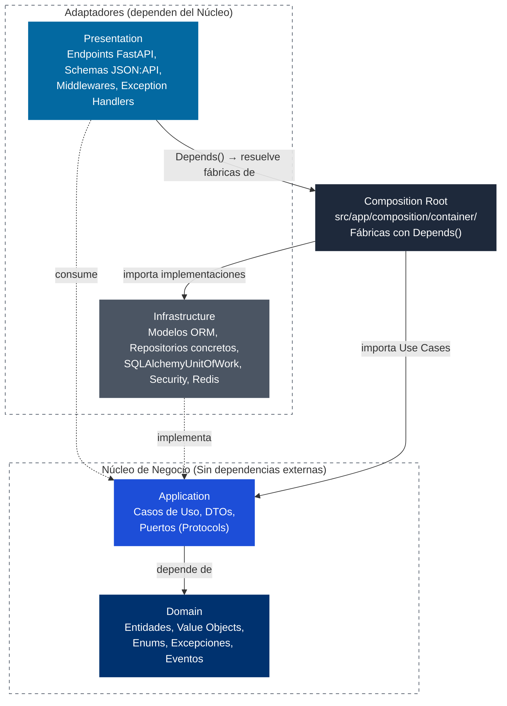
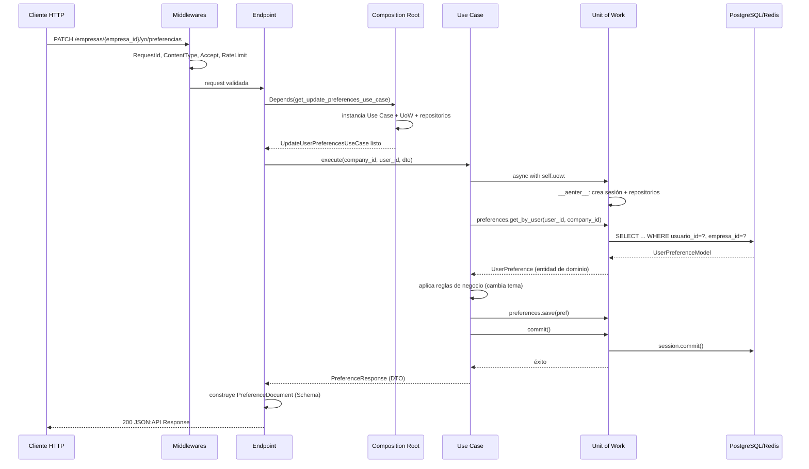
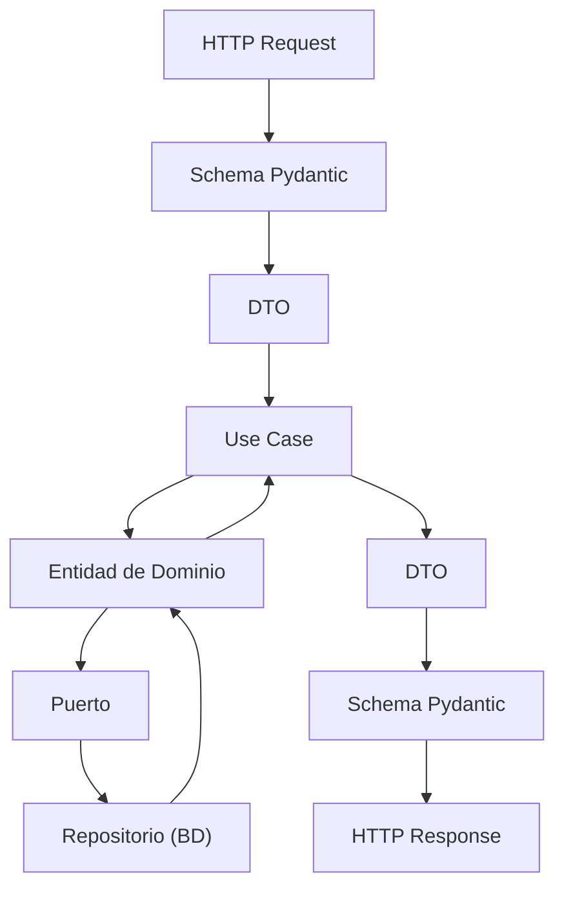

Un endpoint en GEMA es una función de FastAPI que recibe un request HTTP, lo traduce a un DTO, se lo pasa a un Use Case y devuelve una respuesta JSON:API. Nada más.

Puedes pensar en esto como un mesero: él no cocina. Recibe el pedido (request), lo anota (valida el token y los permisos), lo lleva a la cocina (el Use Case), espera el plato y lo trae a la mesa (response). Si el mesero se pone a cocinar, todo se desordena. Cada capa mantiene una responsabilidad delimitada para evitar el acoplamiento.

<Callout type="info">
El acoplamiento (coupling) en ingeniería de software mide el grado de interdependencia que existe entre dos o más módulos, clases o componentes de un sistema.
</Callout>


```python title="src/app/presentation/api/v1/endpoints/preferences.py"
# GET /empresas/{empresa_id}/yo/preferencias

@router.get("", response_model=PreferenceDocument)
async def get_preferences(
    empresa_id: str,
    current_user: UserResponse = Depends(require_permission(PermissionModule.PREFERENCES, "view")),
    use_case: GetUserPreferencesUseCase = Depends(get_user_preference_use_case),
) -> PreferenceDocument:
    res = await use_case.execute(empresa_id, current_user.id)
    return PreferenceDocument(
        data=PreferenceResource(
            id=res.usuario_id,
            attributes=PreferenceAttributes(
                empresa_id=res.empresa_id,
                tema=res.tema,
                version=res.version,
            ),
        )
    )
```

La estructura es siempre la misma: **recibir → convertir → ejecutar → responder**. Si ves lógica de negocio, consultas directas a base de datos o reglas de dominio dentro del endpoint, algo está mal.

Las únicas responsabilidades de un endpoint en GEMA:

- Validar el token JWT (`Authorization: Bearer ...`)
- Verificar permisos RBAC con `Depends(require_permission(...))` cuando aplica
- Mapear el schema JSON:API de entrada (`presentation/api/v1/schemas/`) a un DTO (`application/dtos/`)
- Llamar al Use Case
- Mapear la respuesta de vuelta a JSON:API

---

## El ejemplo: preferences

Para toda esta guía vamos a usar el recurso **preferences** (tabla `preferencias_usuarios`). Son las preferencias o configuraciones de un usuario dentro de una empresa: el tema oscuro o claro, y en el futuro más ajustes de interfaz. Cada usuario tiene exactamente un registro. Esto lo hace más interesante que un CRUD genérico por varias razones:

- Es una relación **1:1 con el usuario**  no tiene ID propio, usa `usuario_id` como PK.
- Solo tiene **GET** (leer) y **PATCH** (actualizar). No hay POST ni DELETE.
- El endpoint usa **RBAC completo** con `require_permission(PermissionModule.PREFERENCES, "view"/"edit")`, igual que el resto de módulos del sistema.
- El endpoint es un **singleton**  no recibe `{id}` en la ruta.

### Schema de la tabla

```sql title="database.dbml"
Table preferencias_usuarios {
  usuario_id uuid      [pk, ref: - usuarios.id]
  empresa_id uuid      [not null, ref: > empresas.id]
  tema       varchar   [default: 'oscuro', not null]
  version    int       [default: 1, not null]
  created_at timestamp [default: `now()`, note: 'con timezone']
  updated_at timestamp [default: `now()`, note: 'con timezone']
}
```

La tabla existe en la base de datos (`database.dbml` la define con esta estructura exacta). Vive en la capa de tenant porque cada fila pertenece a una empresa. La PK es `usuario_id` porque la relación es 1:1.

### Endpoints que vamos a construir

| Método | Ruta | Descripción | Auth |
|--------|------|-------------|------|
| `GET` | `/v1/empresas/{empresa_id}/yo/preferencias` | Obtener preferencias del usuario actual | Bearer |
| `PATCH` | `/v1/empresas/{empresa_id}/yo/preferencias` | Actualizar preferencias del usuario actual | Bearer |

<Callout type="info">
En desarrollo de software, Bearer (literalmente «el portador») es un esquema de autenticación para peticiones HTTP, funciona bajo una regla simple: quien posee el token tiene el acceso, es similar a la tarjeta llave de un hotel. Al sensor de la puerta no le interesa saber quién eres ni cómo te llamas; si tienes la tarjeta en la mano (si eres el portador), la puerta se abre.
</Callout>

---

## Las capas en orden

El proyecto se divide en 5 capas. La regla es estricta: **las capas externas importan a las internas, nunca al revés**.



### Flujo de una request

Este segundo diagrama muestra qué ocurre **en tiempo de ejecución**, no en el código fuente:



---

## Flujo de Trabajo en Git

Antes de escribir código, sigue este flujo estándar de Git:

### Clonar o actualizar el repositorio
Asegúrate de estar en la rama principal y tener los últimos cambios:

```bash
git clone <url-del-repositorio>
cd uneg-gema
git checkout main
git pull origin main
```

### Crear rama de feature

Las ramas de nuevas características se nombran como `feature/nombre-del-modulo`:

```bash
git checkout -b feature/preferencias-usuario
```

### Commits convencionales (Conventional Commits)

GEMA exige seguir la especificación de [Conventional Commits](https://www.conventionalcommits.org/). Los mensajes se escriben en minúscula y en modo imperativo. Aunque el código esté en inglés, los comentarios del commit pueden redactarse en español para mayor claridad del equipo:

Estructura básica:
```xml
<tipo>(<alcance>): <descripción imperativa en español>
```

Encontrarás el commit recomendado para cada etapa al final de su respectiva sección.

---

### Capa de Dominio

Siempre se empieza por esta capa. El dominio no depende de nada externo. No hay SQLAlchemy, FastAPI ni Pydantic. Solo Python puro.

<Files>
  <Folder name="src/app/domain" defaultOpen>
    <File name="__init__.py" />
    <File name="enums.py" />
    <File name="events.py" />
    <Folder name="entities" defaultOpen>
      <File name="__init__.py" />
      <File name="preference.py" />
    </Folder>
    <Folder name="exceptions" defaultOpen>
      <File name="__init__.py" />
      <File name="preference.py" />
    </Folder>
    <Folder name="value_objects" />
  </Folder>
</Files>

Si el módulo es nuevo (preference en este caso), hay que crear los siguientes archivos.

<Callout type="info">
    Cada nuevo módulo del dominio debe crear sus excepciones, value objects (si aplica) y entidad. No importa qué tan simple sea el recurso. El dominio es el núcleo: si no está bien definido a este nivel, el resto de capas arrastran el problema.
</Callout>

#### Excepciones específicas

`src/app/domain/exceptions/preference.py`:

```python title="src/app/domain/exceptions/preference.py"
from app.domain.exceptions.base import DomainException


class PreferenceException(DomainException):
    """Clase base para excepciones del módulo de preferencias."""
    pass


class PreferenceNotFoundError(PreferenceException):
    """Lanzada cuando no se encuentran preferencias para un usuario."""
    pass


class PreferenceThemeInvalidError(PreferenceException):
    """Lanzada cuando se intenta establecer un tema no válido."""
    pass
```

Cada excepción vive en su propio archivo dentro del paquete `exceptions/`, organizado por módulo de dominio. `PreferenceException` es la clase base del módulo, y las excepciones específicas heredan de ella. Esto permite capturar todas las excepciones de preferencias con un solo `except PreferenceException`.

Ahora tenemos que re-exportar en `src/app/domain/exceptions/__init__.py`:

```python title="src/app/domain/exceptions/__init__.py"
# ... importaciones existentes ...
from app.domain.exceptions.preference import (
    PreferenceException,
    PreferenceNotFoundError,
    PreferenceThemeInvalidError,
)

__all__ = [
    # ... items existentes ...
    "PreferenceException",
    "PreferenceNotFoundError",
    "PreferenceThemeInvalidError",
]
```

El `__init__.py` re-exporta las excepciones del módulo para que los use cases puedan importarlas directamente desde `app.domain.exceptions` sin conocer la estructura interna del paquete. El `__all__` explicito ayuda a mypy y a los IDE con el autocompletado.

<Callout type="info">
    El patrón de nombramiento es `[Entidad][Problema]Error`, igual que en el resto del proyecto (`UserAlreadyExistsError`, `AssetCodeExistsError`, `LocationCircularReferenceError`). La excepción base del módulo (`PreferenceException`) permite capturar todas las excepciones de preferencias de una sola vez si hiciera falta. Toda excepción de dominio debe registrarse después en `presentation/exception_handlers/domain.py`. Si no, el cliente recibe un 500 genérico en vez del código HTTP correcto.
</Callout>

#### Enum de dominio

Los enums evitan strings mágicos. Si en el código aparecen `"oscuro"` y `"claro"` como literales repartidos por 5 archivos, un typo (`"oscuro "` con espacio) puede pasar desapercibido hasta producción. Con un enum, el compilador (mypy) y el runtime protegen contra valores inválidos.

**Enum de dominio**

| Pregunta | Respuesta |
|----------|-----------|
| **What** (¿Qué es?) | Una clase que hereda de `StrEnum` (Python 3.11+) y define un conjunto fijo de valores válidos. Cada miembro es un string, pero solo los definidos en la clase son válidos. |
| **Why** (¿Por qué usarlo?) | Centraliza los valores permitidos en un solo lugar, elimina strings mágicos, da autocompletado en el IDE, y mypy detecta si pasás un string cualquiera donde se espera un `Theme`. |
| **Who** (¿Quién lo define?) | La capa de **Domain**. No depende de nada externo. Solo usa `from enum import StrEnum` (stdlib). |
| **Where** (¿Dónde vive?) | En `src/app/domain/enums.py`, un archivo compartido por todo el dominio. No se crea un archivo por módulo  todos los enums del dominio van en el mismo archivo. |
| **When** (¿Cuándo crearlo?) | Cuando un campo de la entidad tiene un conjunto acotado de valores posibles: estados (`Active`, `Inactive`), tipos (`Admin`, `User`), categorías (`Asset`, `Location`), temas (`Dark`, `Light`). |
| **How** (¿Cómo se crea?) | `class Theme(StrEnum):` con atributos de clase en MAYÚSCULAS como convención. El valor es el string que se persiste en BD y viaja en la API. |

Para el campo `tema` de `UserPreference`, los valores son `"oscuro"`, `"claro"` y `"sistema"`:

`src/app/domain/enums.py` (agregar al existente):

```python title="src/app/domain/enums.py"
from enum import StrEnum


class Theme(StrEnum):
    """Tema visual de la interfaz de usuario."""
    DARK = "oscuro"
    LIGHT = "claro"
    SYSTEM = "sistema"
```

`Theme` es un `StrEnum` con tres valores: `DARK`, `LIGHT` y `SYSTEM`. Al heredar de `StrEnum`, cada miembro es directamente comparable con un string: `Theme.DARK == "oscuro"` es `True`. La entidad y los schemas pueden tratar `Theme` como un string sin acceder a `.value`.

<Callout type="info">
**¿Por qué `StrEnum` y no `Enum`?** Con `StrEnum` cada miembro *es* un string: `Theme.DARK == "oscuro"` da `True`. Con `Enum` clásico, tendrías que acceder con `.value` cada vez. La entidad, el repositorio y el schema pueden tratar `Theme` como un string directamente.
</Callout>

<Callout type="info">
La columna `tema` en BD es `varchar` sin CHECK constraint deliberadamente. La validación de valores permitidos ocurre en el dominio mediante `Theme(StrEnum)`, no en la base de datos. Esto permite cambiar el conjunto de temas sin migraciones.
</Callout>

<Callout type="info">
**Validación en la entidad (rica):** el Use Case llama a `pref.change_theme(request.tema)`. El método de la entidad intenta construir `Theme(nuevo_tema)`. Si el string no coincide con ningún miembro, el constructor de `StrEnum` lanza `ValueError`, que la entidad convierte en `PreferenceThemeInvalidError`. La validación ocurre en el dominio, no en el Use Case. El Use Case nunca ve `Theme` ni hace `try/except` de validación.
</Callout>

#### Value Objects

En este caso no necesitamos crear un `PreferenceId`. La PK de la tabla es `usuario_id`, y `UserId` ya existe en `src/app/domain/value_objects/identifier.py`. La entidad usará `UserId` directamente.

<Callout type="warning">
    **PK como `usuario_id` rompe la convención `id`:** todos los modelos del proyecto usan `id` como PK. `UserPreferenceModel` usa `usuario_id` porque es 1:1 con los usuarios. El `SqlAlchemyRepository` base ahora tiene `pk_column: str = "id"` como atributo de clase, y el repositorio de preferencias solo necesita declarar `pk_column = "usuario_id"` para heredar `get_by_id` correctamente. No hace falta sobrescribir el método. El endpoint devuelve `"id": usuario_id` en lugar de un ID propio, que es correcto para JSON:API (el `id` del recurso es el identificador único, no necesariamente una columna llamada `id`). Si en el futuro preferences dejara de ser 1:1, habría que migrar a un `id` propio como PK.
</Callout>

#### Entidad

`src/app/domain/entities/preference.py`:

```python title="src/app/domain/entities/preference.py"
from dataclasses import dataclass, field
from datetime import datetime

from app.domain.enums import Theme
from app.domain.events import DomainEvent, EventProducer
from app.domain.exceptions import PreferenceThemeInvalidError
from app.domain.value_objects import CompanyId, UserId


@dataclass
class UserPreference(EventProducer):
    """Preferencias de interfaz de usuario para un usuario en una empresa."""

    usuario_id: UserId
    empresa_id: CompanyId
    tema: Theme
    version: int = 1
    created_at: datetime | None = None
    updated_at: datetime | None = None
    _events: list[DomainEvent] = field(default_factory=list, init=False, repr=False)

    @classmethod
    def create(
        cls,
        usuario_id: UserId,
        empresa_id: CompanyId,
        tema: Theme = Theme.DARK,
    ) -> "UserPreference":
        """Crea preferencias con valores por defecto y valida invariantes.

        Args:
            usuario_id: Identificador del usuario propietario.
            empresa_id: Identificador de la empresa a la que pertenece.
            tema: Tema visual inicial (por defecto DARK).

        Returns:
            Las nuevas preferencias de usuario creadas.
        """
        return cls(
            usuario_id=usuario_id,
            empresa_id=empresa_id,
            tema=tema,
        )

    def __post_init__(self) -> None:
        """Valida invariantes después de la inicialización.

        Raises:
            PreferenceThemeInvalidError: Si el tema visual está vacío.
        """
        if self.tema is None:
            raise PreferenceThemeInvalidError(
                "El tema visual no puede estar vacío."
            )

    def pull_events(self) -> list[DomainEvent]:
        """Devuelve los eventos de dominio acumulados y limpia la lista interna.

        Returns:
            La lista de eventos de dominio acumulados, vaciando la lista interna.
        """
        events = self._events.copy()
        self._events.clear()
        return events

    def change_theme(self, nuevo_tema: str) -> None:
        """Cambia el tema visual. Acepta str para que la validación sea en dominio.

        Args:
            nuevo_tema: El nuevo tema visual a aplicar.

        Raises:
            PreferenceThemeInvalidError: Si el tema no es uno de los valores válidos.
        """
        try:
            tema_validado = Theme(nuevo_tema)
        except ValueError:
            raise PreferenceThemeInvalidError(
                f"El tema '{nuevo_tema}' no es válido. "
                f"Valores permitidos: {', '.join(t.value for t in Theme)}."
            ) from None
        self.tema = tema_validado
```

`UserPreference` es una entidad rica: tiene un método fábrica `create()`, validación de invariantes en `__post_init__` y un método de cambio `change_theme()` que valida el tema en el dominio. El Use Case no muta campos directamente, sino que llama a `pref.change_theme(request.tema)`. La entidad controla su propio estado.

Re-exportar en `src/app/domain/entities/__init__.py`:

```python title="src/app/domain/entities/__init__.py"
from app.domain.entities.preference import UserPreference
```

<Callout type="info">
**Clase pura de Python, qué significa exactamente:** Una "clase pura de Python" usa exclusivamente la biblioteca estándar (`dataclasses`, `datetime`, `uuid`, `enum`, `typing`). No importa nada de terceros:

| ✅ Permitido (stdlib) | ❌ Prohibido (externo) |
|---|---|
| `from dataclasses import dataclass` | `from pydantic import BaseModel` |
| `from datetime import datetime` | `from sqlalchemy import Column` |
| `from enum import StrEnum` | `from fastapi import Query` |
| `import uuid` | `from structlog import get_logger` |
</Callout>

<Callout type="info">
Esta clase no sabe si los datos vienen de PostgreSQL, de un archivo CSV o de una API. Solo sabe que sus campos tienen ciertos tipos y que sus métodos validan reglas del negocio. Es el contrato más puro del sistema.
</Callout>

<Callout type="info">
**Regla de oro**: Para mantener la lógica de negocio pura y desacoplada en la capa de Dominio, los desarrolladores deben evitar importar cualquier librería de terceros durante el modelado de entidades y reglas de negocio, asegurando así que el núcleo del sistema sea inmune a cambios tecnológicos, obsolescencias o migraciones de frameworks; esto se valida de forma práctica verificando que ningún módulo importado en el Dominio figure como dependencia externa en el archivo pyproject.toml.
</Callout>

**Entidad anémica vs Entidad rica**

| Dimensión | Entidad anémica | Entidad rica |
|-----------|----------------|--------------|
| **What** (qué) | Solo datos. Un `@dataclass` con campos y cero métodos de negocio. | Datos + reglas de negocio + eventos + métodos fábrica. |
| **Why** (por qué) | El concepto no tiene reglas complejas. Solo almacena y expone valores. | El concepto tiene invariantes que proteger, decisiones que registrar o eventos que emitir. |
| **Who** (quién) | Cualquier caso de uso puede leer/escribir campos directamente. | Solo los métodos públicos de la entidad modifican su estado. Nadie la "setea". |
| **When** (cuándo) | Settings de usuario, metadatos simples, flags sin lógica asociada. | Usuario, Rol, Compañía, Órdenes de Trabajo  cualquier cosa con lógica de negocio. |
| **Where** (dónde) | `domain/entities/`  mismo lugar que las ricas. | `domain/entities/`  mismo lugar que las anémicas. |
| **How** (cómo) | `@dataclass` plano. Los casos de uso leen y asignan valores directamente. | Clase con `@classmethod` fábrica, métodos como `activate()`, `has_permission()`, `pull_events()`. La entidad controla su propio estado. |

<Callout type="info">
**Regla práctica en GEMA**: las entidades nuevas empiezan con logica de negocio (rich entities) desde el primer día, con un método de fábrica `create()`, validación de invariantes en `__post_init__` y métodos de cambio como `change_theme()`  como `UserPreference` más arriba. En GEMA no hay entidades anémicas en producción. El `@dataclass` sin métodos solo sirve como boceto inicial mientras se define la estructura; antes del primer commit, la entidad debe tener sus invariantes protegidas. Cuando el use case necesite una validación nueva, no escribas un `if` en el use case: sube esa lógica a la entidad.
</Callout>

<Callout type="info">
Una invariante es una regla de negocio inmutable que siempre debe cumplirse para que un objeto del sistema sea válido
</Callout>

<Callout type="tip">
**Ejemplo de commit para esta capa:**
```bash
git commit -m "feat(backend): agregar entidad [nombre_entidad] y excepciones [nombre_excepciones]"
```
</Callout>

---

### Capa de Aplicación

`src/app/application/`

En esta capa se define el contrato (DTOs + Puerto) y la orquestación (Use Cases). Sigue siendo código puro, sin SQLAlchemy ni FastAPI.

<Files>
  <Folder name="src/app/application" defaultOpen>
    <Folder name="dtos" defaultOpen>
      <File name="preference_dtos.py" />
    </Folder>
    <Folder name="ports" defaultOpen>
      <File name="preference_repository.py" />
      <File name="unit_of_work.py" />
    </Folder>
    <Folder name="use_cases" defaultOpen>
      <Folder name="preference" defaultOpen>
        <File name="__init__.py" />
        <File name="get_user_preference.py" />
        <File name="update_user_preference.py" />
      </Folder>
    </Folder>
  </Folder>
</Files>

<Callout type="info">
**Recordatorio:** los DTOs son clases de Python puras e inmutables. Los Puertos son interfaces (Protocols). Los Use Cases son clases que orquestan: reciben un DTO o parámetros, llaman al puerto, devuelven un DTO. Nunca reciben un schema de FastAPI ni devuelven un modelo de BD.
</Callout>

#### DTOs

`src/app/application/dtos/preference_dtos.py`:

```python title="src/app/application/dtos/preference_dtos.py"
from dataclasses import dataclass


@dataclass(frozen=True)
class PreferenceResponse:
    """DTO de salida con las preferencias del usuario."""

    usuario_id: str
    empresa_id: str
    tema: str
    version: int = 0


@dataclass(frozen=True)
class UpdatePreferenceRequest:
    """DTO de entrada para la actualización de preferencias de usuario."""

    tema: str | None = None
    version: int | None = None
```

Los DTOs son `@dataclass(frozen=True)` inmutables. `PreferenceResponse` es la respuesta plana (sin anidamiento JSON:API) que viaja del Use Case al endpoint. `UpdatePreferenceRequest` es el DTO de entrada con `tema` como opcional (el PATCH puede actualizar solo algunos campos).

<Callout type="info">
**Clase pura de Python  concepto (otra vez, pero con DTOs):** `@dataclass(frozen=True)` es inmutable. No tiene métodos de framework. No serializa, no valida, no lanza excepciones automáticas. Solo transporta datos de un lado a otro. Viaja del endpoint al Use Case y del Use Case al endpoint.
</Callout>

<Callout type="info">
El DTO es la moneda que circula entre Presentation y Application. La entidad de dominio es la moneda que circula entre Application e Infrastructure (a través del Puerto). Son dos monedas distintas, para dos tramos distintos del viaje. Si mezclas los tramos si el Use Case devuelve un modelo ORM o recibe un schema Pydantic rompes el aislamiento de capas.
</Callout>



<Callout type="info">
Los DTOs transportan representaciones serializables (`str`, `int`), no objetos de dominio. La conversión de `Theme` a `str` la hace el Use Case al construir el DTO de respuesta.
</Callout>

#### Puerto de repositorio (Interface)

`src/app/application/ports/preference_repository.py`:

```python title="src/app/application/ports/preference_repository.py"
from typing import Protocol

from app.domain.entities import UserPreference
from app.domain.value_objects import CompanyId, UserId


class PreferenceRepositoryPort(Protocol):
    """Puerto de repositorio para preferencias de usuario."""

    async def get_by_user(
        self, usuario_id: UserId, empresa_id: CompanyId
    ) -> UserPreference | None:
        """Obtiene las preferencias de un usuario en una empresa."""
        ...

    async def save(self, preference: UserPreference) -> None:
        """Persiste la entidad (INSERT si no existe, UPDATE si existe)."""
        ...
```

`PreferenceRepositoryPort` declara los métodos que cualquier repositorio de preferencias debe implementar: `get_by_user()` para buscar por usuario+empresa, y `save()` para persistir (INSERT o UPDATE según exista). No incluye `get_by_id()` porque el repositorio concreto lo hereda de `SqlAlchemyRepository` gracias a `pk_column`.

**Interface (Protocol) concepto**

| Pregunta | Respuesta |
|----------|-----------|
| **What** (¿Qué es?) | Un `Protocol` de `typing` es un **contrato estructural**. Declara qué métodos debe tener una clase y con qué firmas, sin decir *cómo* funcionan. Es duck typing validado en tiempo de compilación (mypy). |
| **Why** (¿Por qué usarlo?) | Para **desacoplar** la definición del "qué hacer" (Application) de la implementación del "cómo hacerlo" (Infrastructure). Si mañana cambias PostgreSQL por MySQL, solo cambia Infrastructure. El Use Case ni se entera. |
| **Who** (¿Quién lo define? ¿Quién lo implementa?) | **Application** define el Protocol (el Puerto). **Infrastructure** implementa una clase concreta que cumple el contrato (el Adaptador). **Composition Root** conecta ambos en tiempo de ejecución. |
| **Where** (¿Dónde vive?) | Los Protocols están en `src/app/application/ports/`. Las implementaciones en `src/app/infrastructure/repositories/`. |
| **When** (¿Cuándo se crea?) | Cuando un Use Case necesita delegar una operación a Infrastructure (persistencia, hashing, envío de emails, etc.). Se diseña el Puerto **antes** de escribir la implementación concreta. |
| **How** (¿Cómo se escribe?) | `class MiPuerto(Protocol):` con métodos async, firmas tipadas y `...` en el cuerpo. El Use Case lo recibe en su `__init__`. Infrastructure implementa una clase con los mismos métodos. |

<Callout type="info">
**Diferencia clave con ABC:** `Protocol` usa **tipado estructural** (no necesitas heredar explícitamente). ABC usa **tipado nominal** (debes escribir `class X(AbstractBase)`). Protocol es más flexible: cualquier clase con los métodos correctos es válida, aunque no haya declarado `implements MiProtocol`.
</Callout>

<Callout type="info">
**Duck Typing** es un estilo de programación en Python donde el intérprete evalúa la validez de un objeto en tiempo de ejecución fijándose únicamente en si este tiene los métodos o atributos necesarios en lugar de validar su tipo o herencia explícita, permitiendo a los desarrolladores escribir código altamente flexible y desacoplado de jerarquías rígidas de clases.
</Callout>

#### Registrar en UnitOfWorkPort

Editar `src/app/application/ports/unit_of_work.py`:

```python title="src/app/application/ports/unit_of_work.py"
from app.application.ports.preference_repository import PreferenceRepositoryPort


class UnitOfWorkPort(Protocol):
    # ... atributos existentes ...
    preferences: PreferenceRepositoryPort
```

Agregar `preferences: PreferenceRepositoryPort` al `UnitOfWorkPort` permite que cualquier Use Case acceda al repositorio de preferencias a través de `self.uow.preferences`. El UnitOfWork es el punto único de acceso a todos los repositorios dentro de una transacción.

<Callout type="info">
**Nota sobre el UoW:** El UnitOfWork maneja el ciclo de vida de la transacción: `__aenter__` abre la sesión, `commit()` persiste los cambios y publica eventos, `__aexit__` solo libera la sesión (no hace auto-commit). Los use cases de escritura deben llamar a `commit()` explícitamente. Los de lectura usan `async with self.uow` solo para abrir una sesión de lectura.
</Callout>

#### Use Cases

Creamos dos. Uno para GET y otro para PATCH.

`src/app/application/use_cases/preference/get_user_preference.py`:

```python title="src/app/application/use_cases/preference/get_user_preference.py"
from app.application.dtos.preference_dtos import PreferenceResponse
from app.application.ports.unit_of_work import UnitOfWorkPort
from app.domain.exceptions import PreferenceNotFoundError
from app.domain.value_objects import CompanyId, UserId


class GetUserPreferencesUseCase:
    """Obtiene las preferencias del usuario autenticado."""

    def __init__(self, uow: UnitOfWorkPort) -> None:
        self.uow = uow

    async def execute(
        self, company_id_str: str, user_id_str: str
    ) -> PreferenceResponse:
        """Obtiene las preferencias del usuario."""
        company_id = CompanyId.from_string(company_id_str)
        user_id = UserId.from_string(user_id_str)

        async with self.uow:  # Solo abre sesión de lectura; no necesita commit
            pref = await self.uow.preferences.get_by_user(user_id, company_id)
            if not pref:
                raise PreferenceNotFoundError(
                    f"No se encontraron preferencias para el usuario "
                    f"'{user_id_str}' en la empresa '{company_id_str}'."
                )

            return PreferenceResponse(
                usuario_id=str(pref.usuario_id),
                empresa_id=str(pref.empresa_id),
                tema=pref.tema.value,
                version=pref.version,
            )
```

`GetUserPreferencesUseCase` es un caso de uso de solo lectura: recibe strings, los convierte a Value Objects, busca las preferencias y devuelve un DTO. Si no existen, lanza `PreferenceNotFoundError` que se mapea a 404. No necesita `commit()` porque no escribe.

<Callout type="info">
**Para lecturas simples**: se pasan `company_id_str` y `user_id_str` como parámetros directos. Para casos con cuerpo (PATCH), usamos un DTO de entrada. Convención: si hay más de 2 parámetros, usa DTO siempre.
</Callout>

`src/app/application/use_cases/preference/update_user_preference.py`:

```python title="src/app/application/use_cases/preference/update_user_preference.py"
from app.application.dtos.preference_dtos import (
    PreferenceResponse,
    UpdatePreferenceRequest,
)
from app.application.ports.unit_of_work import UnitOfWorkPort
from app.domain.entities import UserPreference
from app.domain.value_objects import CompanyId, UserId


class UpdateUserPreferencesUseCase:
    """Actualiza las preferencias del usuario autenticado.
    Si no existen, crea un registro con valores por defecto (upsert).
    """

    def __init__(self, uow: UnitOfWorkPort) -> None:
        self.uow = uow

    async def execute(
        self,
        company_id_str: str,
        user_id_str: str,
        request: UpdatePreferenceRequest,
    ) -> PreferenceResponse:
        """Actualiza las preferencias del usuario o crea unas por defecto."""
        company_id = CompanyId.from_string(company_id_str)
        user_id = UserId.from_string(user_id_str)

        async with self.uow:
            pref = await self.uow.preferences.get_by_user(user_id, company_id)

            if not pref:
                pref = UserPreference.create(
                    usuario_id=user_id,
                    empresa_id=company_id,
                )

            if request.tema is not None:
                pref.change_theme(request.tema)

            await self.uow.preferences.save(pref)
            await self.uow.commit()

            return PreferenceResponse(
                usuario_id=str(pref.usuario_id),
                empresa_id=str(pref.empresa_id),
                tema=pref.tema.value,
                version=pref.version,
            )
```

`UpdateUserPreferencesUseCase` es un caso de uso de escritura con upsert: si no existen preferencias, las crea con valores por defecto (`UserPreference.create()`). Si existe y se pasa un `tema`, delega la validación a la entidad mediante `pref.change_theme(request.tema)`. Finalmente persiste con `save()` y confirma la transacción con `commit()`.

<Callout type="info">
El Use Case nunca devuelve la entidad directamente. Siempre devuelve un DTO. Si devolvés la entidad, el endpoint podría modificarla directamente, rompiendo el encapsulamiento. El Use Case es el orquestador: recibe un DTO plano o parámetros, llama al Puerto (que delega a Infrastructure), aplica reglas de dominio, y devuelve otro DTO plano. La cadena de delegación completa es: Presentation delega en Application, Application delega en Infrastructure a través del Puerto, pero Application mantiene el control de la orquestación.
</Callout>

Exportar en `src/app/application/use_cases/preference/__init__.py`:

```python title="src/app/application/use_cases/preference/__init__.py"
from app.application.use_cases.preference.get_user_preference import GetUserPreferencesUseCase
from app.application.use_cases.preference.update_user_preference import UpdateUserPreferencesUseCase

__all__ = [
    "GetUserPreferencesUseCase",
    "UpdateUserPreferencesUseCase",
]
```

El `__init__.py` re-exporta los dos Use Cases para que el Composition Root pueda importarlos desde `app.application.use_cases.preference` sin acoplarse a la estructura interna del paquete.

<Callout type="tip">
**Ejemplo de commit para esta capa:**
```bash
git commit -m "feat(backend): crear casos de uso y dtos para [nombre_modulo]"
```
</Callout>

---

### Capa de Infraestructura

`src/app/infrastructure/`

En esta capa se materializa el puerto contra SQLAlchemy. Si el Puerto es el contrato (la interfaz que define qué hacer), Infrastructure es la implementación concreta (cómo hacerlo). Este es el único lugar que sabe que la BD es PostgreSQL.

<Files>
  <Folder name="src/app/infrastructure" defaultOpen>
    <Folder name="db" defaultOpen>
      <Folder name="models" defaultOpen>
        <File name="__init__.py" />
        <File name="preference.py" />
      </Folder>
    </Folder>
    <Folder name="repositories" defaultOpen>
      <File name="__init__.py" />
      <File name="preference_repository.py" />
    </Folder>
    <File name="uow.py" />
  </Folder>
</Files>

#### Modelo ORM

`src/app/infrastructure/db/models/preference.py`:

```python title="src/app/infrastructure/db/models/preference.py"
import uuid

from sqlalchemy import ForeignKey, String
from sqlalchemy.orm import Mapped, mapped_column

from app.infrastructure.db.base import Base
from app.infrastructure.db.models.mixins import TenantMixin, TimestampMixin, VersionMixin


class UserPreferenceModel(VersionMixin, TenantMixin, TimestampMixin, Base):
    """Modelo ORM para la tabla preferencias_usuarios (1:1 con usuarios)."""

    __tablename__ = "preferencias_usuarios"

    usuario_id: Mapped[uuid.UUID] = mapped_column(
        ForeignKey("usuarios.id", ondelete="CASCADE"), primary_key=True
    )
    tema: Mapped[str] = mapped_column(String(20), nullable=False, default="oscuro")
```

`UserPreferenceModel` es el modelo ORM que mapea a la tabla `preferencias_usuarios`. Hereda de `TenantMixin` (hereda `empresa_id`), `TimestampMixin` (hereda `created_at` y `updated_at`), y `Base`. La PK es `usuario_id` como ForeignKey a `usuarios.id`.

<Callout type="info">
Notá que **hereda de `TenantMixin`**, igual que todos los modelos multi-tenant del proyecto (`UserModel`, `AssetModel`, `LocationModel`, etc.). `TenantMixin` provee el campo `empresa_id` automáticamente, con su ForeignKey e índice. Por eso no lo declaramos en el cuerpo de la clase.
</Callout>

Re-exportar en `src/app/infrastructure/db/models/__init__.py`:

```python title="src/app/infrastructure/db/models/__init__.py"
from app.infrastructure.db.models.preference import UserPreferenceModel
```

Re-exportar el modelo en el `__init__.py` del paquete de modelos para que Alembic lo detecte al generar migraciones automaticas y para que otros módulos puedan importarlo desde `app.infrastructure.db.models`.

#### Repositorio concreto

`src/app/infrastructure/repositories/preference_repository.py`:

```python title="src/app/infrastructure/repositories/preference_repository.py"
from sqlalchemy import select
from sqlalchemy.ext.asyncio import AsyncSession

from app.application.ports.preference_repository import PreferenceRepositoryPort
from app.domain.entities import UserPreference
from app.domain.enums import Theme
from app.domain.events import DomainEvent
from app.domain.value_objects import CompanyId, UserId
from app.infrastructure.db.models.preference import UserPreferenceModel
from app.infrastructure.repositories.base import SqlAlchemyRepository


class SqlAlchemyPreferenceRepository(
    SqlAlchemyRepository[UserPreferenceModel, UserPreference, UserId],
    PreferenceRepositoryPort,
):
    """Implementación en SQLAlchemy para el puerto de Preferencias."""

    pk_column = "usuario_id"

    def __init__(
        self, session: AsyncSession, pending_events: list[DomainEvent] | None = None
    ) -> None:
        super().__init__(session, UserPreferenceModel, pending_events)

    def _to_model(self, entity: UserPreference) -> UserPreferenceModel:
        return UserPreferenceModel(
            usuario_id=entity.usuario_id.value,
            empresa_id=entity.empresa_id.value,
            tema=entity.tema.value,
            version=entity.version,
        )

    def _to_entity(self, model: UserPreferenceModel) -> UserPreference:
        return UserPreference(
            usuario_id=UserId(model.usuario_id),
            empresa_id=CompanyId(model.empresa_id),
            tema=Theme(model.tema),
            version=model.version,
            created_at=model.created_at,
            updated_at=model.updated_at,
        )

    # get_by_id se hereda de SqlAlchemyRepository gracias a pk_column = "usuario_id"

    async def get_by_user(
        self, usuario_id: UserId, empresa_id: CompanyId
    ) -> UserPreference | None:
        """Obtiene las preferencias de un usuario en una empresa."""
        stmt = select(UserPreferenceModel).where(
            UserPreferenceModel.usuario_id == usuario_id.value,
            UserPreferenceModel.empresa_id == empresa_id.value,
        )
        result = await self.session.execute(stmt)
        model = result.scalar_one_or_none()
        if not model:
            return None
        return self._to_entity(model)
```

`SqlAlchemyPreferenceRepository` implementa el puerto. Declara `pk_column = "usuario_id"` para que `get_by_id()` y `delete()` heredados de `SqlAlchemyRepository` usen la columna correcta como PK. `get_by_user()` es un método ad-hoc para buscar por usuario+empresa.

El repositorio concreto implementa `PreferenceRepositoryPort` (el contrato). Hace dos cosas: traduce de modelo ORM a entidad de dominio (`_to_entity`) y de entidad a modelo ORM (`_to_model`). El Use Case nunca ve el modelo ORM. Solo ve la entidad. Infrastructure es el puente entre ambos mundos.

No necesita sobrescribir `get_by_id` porque declara `pk_column = "usuario_id"` como atributo de clase. El `SqlAlchemyRepository` base ahora tiene `pk_column: str = "id"` como atributo parametrizable, y el repositorio solo cambia el valor para adaptarse a su PK no convencional.

**Mapping ORM ↔ Entidad de dominio**

| Pregunta | Respuesta |
|----------|-----------|
| **What** (¿Qué es?) | Es la traducción explícita y bidireccional entre dos representaciones del mismo dato: el modelo ORM (una clase de SQLAlchemy atada a la tabla PostgreSQL) y la entidad de dominio (una clase pura de Python sin rastro de infraestructura). |
| **Why** (¿Por qué usarlo?) | Para mantener el aislamiento de capas. La entidad de dominio no debe importar SQLAlchemy, y el modelo ORM no debe salir de Infrastructure. Si el Use Case recibiera un modelo ORM, quedaría acoplado a la base de datos. El mapping es el puente que evita ese acoplamiento. |
| **Who** (¿Quién lo realiza?) | La capa Infrastructure, específicamente el repositorio concreto (`SqlAlchemyPreferenceRepository`). Es el único lugar del sistema que conoce ambos mundos. |
| **When** (¿Cuándo se ejecuta?) | En tiempo de request, durante cada operación de persistencia: escritura (`_to_model`: entity → model) cuando el Use Case llama a `save()`, y lectura (`_to_entity`: model → entity) cuando ejecuta `get_by_user()`. |
| **Where** (¿Dónde vive?) | En los métodos `_to_model()` and `_to_entity()` de cada repositorio concreto, dentro de `src/app/infrastructure/repositories/`. |
| **How** (¿Cómo se hace?) | Mediante mapeo explícito, campo por campo, sin atajos ni conversión automática. `_to_entity` toma un modelo y construye una entidad con sus Value Objects (`UserId`, `CompanyId`, `Theme`). `_to_model` hace el camino inverso. Nunca hay "magia". Esto hace que el código sea rastreable, testeable y fácil de modificar cuando cambia la base de datos o el dominio. |

#### Registrar en el UnitOfWork

Editar `src/app/infrastructure/uow.py`:

```python title="src/app/infrastructure/uow.py"
from app.infrastructure.repositories.preference_repository import (
    SqlAlchemyPreferenceRepository,
)


class SqlAlchemyUnitOfWork(UnitOfWorkPort):
    async def __aenter__(self) -> Self:
        # ... otros repositorios ...
        self.preferences = SqlAlchemyPreferenceRepository(
            self.session, self._pending_events
        )
        return self
```

#### Migración Alembic

```bash title="Terminal"
poetry run alembic revision --autogenerate -m "create user preferences table"
poetry run alembic upgrade head
```

<Callout type="info">
**Nota:** GEMA usa Alembic en modo async (con `AsyncEngine`). Asegurate de que tu `alembic/env.py` esté configurado para usar el `AsyncEngine` del proyecto (ver `src/app/infrastructure/db/session.py`). Sin esta configuración, `--autogenerate` no detectará los modelos correctamente.
</Callout>

<Callout type="tip">
**Ejemplo de commit para esta capa:**
```bash
git commit -m "feat(backend): implementar modelo orm y repositorio de [nombre_modulo]"
```
</Callout>

---

### Capa de Presentación

En esta capa se traduce HTTP/JSON:API a DTOs y viceversa. Nunca se llama a un repositorio desde este nivel. La Presentation solo sabe de FastAPI y Pydantic.

<Files>
  <Folder name="src/app/presentation" defaultOpen>
    <Folder name="api" defaultOpen>
      <Folder name="v1" defaultOpen>
        <Folder name="endpoints" defaultOpen>
          <File name="preferences.py" />
        </Folder>
        <Folder name="schemas" defaultOpen>
          <File name="preferences.py" />
        </Folder>
        <File name="router.py" />
      </Folder>
    </Folder>
    <Folder name="exception_handlers" defaultOpen>
      <File name="domain.py" />
    </Folder>
  </Folder>
</Files>

#### Schemas JSON:API

`src/app/presentation/api/v1/schemas/preferences.py`:

```python title="src/app/presentation/api/v1/schemas/preferences.py"
from typing import Any

from pydantic import BaseModel, Field


class PreferenceAttributes(BaseModel):
    """Atributos de las preferencias de usuario."""

    empresa_id: str
    tema: str
    version: int


class PreferenceResource(BaseModel):
    """Recurso JSON:API de preferencias de usuario."""

    type: str = Field(default="preferences")
    id: str
    attributes: PreferenceAttributes


class PreferenceDocument(BaseModel):
    """Documento JSON:API con preferencias de usuario."""

    data: PreferenceResource
    meta: dict[str, Any] | None = None


# Solicitud de actualización
class UpdatePreferenceAttributes(BaseModel):
    """Atributos para actualizar preferencias."""

    tema: str | None = None
    version: int | None = None


class UpdatePreferenceResource(BaseModel):
    """Recurso JSON:API para actualizar preferencias."""

    type: str = Field(default="preferences")
    id: str
    attributes: UpdatePreferenceAttributes


class UpdatePreferenceRequest(BaseModel):
    """Solicitud JSON:API para actualizar preferencias."""

    data: UpdatePreferenceResource
```

Los schemas JSON:API definen la estructura que el cliente HTTP recibe y envía. `PreferenceDocument` envuelve el recurso, `PreferenceResource` tiene `type`, `id` y `attributes`. `UpdatePreferenceRequest` es el schema de entrada para PATCH con la estructura JSON:API completa (`data.attributes.tema`).

<Callout type="info">
**Recordatorio:** los Schemas siempre tienen estructura JSON:API: `{ data: { type, id, attributes: {...} } }`. Los DTOs son planos: `{ campo1, campo2 }`. No los confundas. El Schema es la vista que el cliente HTTP tiene del recurso. El DTO es la vista que la Application tiene del mismo recurso. Son dos perspectivas distintas del mismo dato, y la traducción entre ambas es responsabilidad exclusiva del endpoint.

Notá que `UpdatePreferenceResource` incluye `id`, como exige la especificación JSON:API para actualizaciones de recursos. Aunque el servidor pueda deducir el `id` del token de autenticación, el estándar requiere que el cliente lo envíe explícitamente.
</Callout>

#### Endpoint

`src/app/presentation/api/v1/endpoints/preferences.py`:

```python title="src/app/presentation/api/v1/endpoints/preferences.py"
from fastapi import APIRouter, Depends

from app.application.dtos.auth_dtos import UserResponse
from app.application.dtos.preference_dtos import (
    UpdatePreferenceRequest as UpdatePreferenceDTO,
)
from app.application.use_cases.preference import (
    GetUserPreferencesUseCase,
    UpdateUserPreferencesUseCase,
)
from app.composition.container import (
    get_update_preference_use_case,
    get_user_preference_use_case,
)
from app.domain.enums import PermissionModule
from app.presentation.api.v1.endpoints.dependencies import (
    require_permission,
)
from app.presentation.api.v1.schemas.preferences import (
    PreferenceAttributes,
    PreferenceDocument,
    PreferenceResource,
    UpdatePreferenceRequest,
)

router = APIRouter()

# GET /empresas/{empresa_id}/yo/preferencias
@router.get(
    "",
    response_model=PreferenceDocument,
    summary="Obtener preferencias del usuario actual",
)
async def get_preferences(
    empresa_id: str,
    current_user: UserResponse = Depends(require_permission(PermissionModule.PREFERENCES, "view")),
    use_case: GetUserPreferencesUseCase = Depends(get_user_preference_use_case),
) -> PreferenceDocument:
    """Obtiene las preferencias del usuario autenticado."""
    res = await use_case.execute(empresa_id, current_user.id)
    return PreferenceDocument(
        data=PreferenceResource(
            id=res.usuario_id,
            attributes=PreferenceAttributes(
                empresa_id=res.empresa_id,
                tema=res.tema,
                version=res.version,
            ),
        )
    )


# PATCH /empresas/{empresa_id}/yo/preferencias
@router.patch(
    "",
    response_model=PreferenceDocument,
    summary="Actualizar preferencias del usuario actual",
)
async def update_preferences(
    empresa_id: str,
    request: UpdatePreferenceRequest,
    current_user: UserResponse = Depends(require_permission(PermissionModule.PREFERENCES, "edit")),
    use_case: UpdateUserPreferencesUseCase = Depends(get_update_preference_use_case),
) -> PreferenceDocument:
    """Actualiza las preferencias del usuario autenticado."""
    dto = UpdatePreferenceDTO(
        tema=request.data.attributes.tema,
        version=request.data.attributes.version,
    )
    res = await use_case.execute(empresa_id, current_user.id, dto)
    return PreferenceDocument(
        data=PreferenceResource(
            id=res.usuario_id,
            attributes=PreferenceAttributes(
                empresa_id=res.empresa_id,
                tema=res.tema,
                version=res.version,
            ),
        )
    )
```

El endpoint usa `require_permission(PermissionModule.PREFERENCES, "view"/"edit")` que unifica autenticación + validación de tenant + RBAC en una sola dependencia. Luego traduce el schema Pydantic a un DTO, llama al Use Case y construye la respuesta JSON:API.

El endpoint recibe el request HTTP (qué), lo valida contra el usuario autenticado (quién) en el contexto de la empresa del path (dónde), en el momento de la llamada (cuándo), para obtener o modificar las preferencias visuales (por qué), y lo hace traduciendo el schema a DTO, llamando al Use Case, y devolviendo un documento JSON:API (cómo).

<Callout type="tip">
**Validación multi-tenant unificada:** desde v7, `require_permission()` integra la validación de tenant. Compara automáticamente el `company_id` del path contra `current_user.empresa_id` antes del chequeo RBAC. Esto cierra la fuga multi-tenant (IDOR) en todos los endpoints que usan la dependencia. Para endpoints que solo necesitan validación de tenant sin RBAC (ej: listar roles o ubicaciones), existe `Depends(require_tenant_read)` como alternativa ligera.
</Callout>

#### Registrar el router

Editar `src/app/presentation/api/v1/router.py`:

```python title="src/app/presentation/api/v1/router.py"
from app.presentation.api.v1.endpoints.preferences import router as preferences_router

v1_router.include_router(
    preferences_router,
    prefix="/empresas/{empresa_id}/yo/preferencias",
    tags=["preferencias"],
)
```

Registrar el router de preferencias en el `v1_router` con el prefijo `/empresas/{empresa_id}/yo/preferencias`. La ruta no tiene `{id}` porque preferences es un singleton por usuario.

#### Mapear excepciones

Editar `src/app/presentation/exception_handlers/domain.py`, agregar al `_EXCEPTION_MAP`:

```python title="src/app/presentation/exception_handlers/domain.py"
from app.domain.exceptions import (
    # ... Otras excepciones importadas
    PreferenceNotFoundError,
    PreferenceThemeInvalidError,
)

_EXCEPTION_MAP: dict[type[DomainException], tuple[int, str]] = {
    # ... Otras excepciones mapeadas
    PreferenceNotFoundError: (
        status.HTTP_404_NOT_FOUND, 
        "ERR_PREFERENCE_NOT_FOUND"
    ),
    PreferenceThemeInvalidError: (
        status.HTTP_422_UNPROCESSABLE_ENTITY, 
        "ERR_PREFERENCE_THEME_INVALID"
    ),
}
```

`_EXCEPTION_MAP` asocia cada excepción de dominio con un código HTTP y un error code. `PreferenceNotFoundError` → 404, `PreferenceThemeInvalidError` → 422. Sin este registro, el cliente recibiria un 500 generico en vez del codigo HTTP correcto.

<Callout type="tip">
**Ejemplo de commit para esta capa:**
```bash
git commit -m "feat(backend): agregar endpoint de FastAPI y schemas jsonapi de [nombre_modulo]"
```
</Callout>

---

### Capa de Composición

`src/app/composition/container/`

Es el Composition Root: solo cablea dependencias. No hay lógica de negocio en esta capa. Es el pegamento que une las capas.

<Files>
  <Folder name="src/app/composition/container" defaultOpen>
    <File name="__init__.py" />
    <File name="preference.py" />
  </Folder>
</Files>

`src/app/composition/container/preference.py`:

```python title="src/app/composition/container/preference.py"
"""Fábricas de dependencias para los casos de uso de preferencias."""

from fastapi import Depends

from app.application.ports.unit_of_work import UnitOfWorkPort
from app.application.use_cases.preference import (
    GetUserPreferencesUseCase,
    UpdateUserPreferencesUseCase,
)
from app.composition.container.common import get_uow


async def get_user_preference_use_case(
    uow: UnitOfWorkPort = Depends(get_uow),
) -> GetUserPreferencesUseCase:
    """Fábrica de dependencias para el caso de uso de consulta de preferencias del usuario."""
    return GetUserPreferencesUseCase(uow)


async def get_update_preference_use_case(
    uow: UnitOfWorkPort = Depends(get_uow),
) -> UpdateUserPreferencesUseCase:
    """Fábrica de dependencias para el caso de uso de actualización de preferencias del usuario."""
    return UpdateUserPreferencesUseCase(uow)
```

Las fábricas del Composition Root cablean las dependencias. `get_user_preference_use_case` (lectura) y `get_update_preference_use_case` (escritura) reciben el UoW via `Depends(get_uow)` y construyen el Use Case correspondiente. No hay lógica de negocio, solo instanciación.

Exportar en `src/app/composition/container/__init__.py`:

```python title="src/app/composition/container/__init__.py"

# ... otras importaciones ...
from app.composition.container.preference import (
    get_update_preference_use_case,
    get_user_preference_use_case,
)

__all__ = [
    # ... otras exportaciones ...
    # Preferences
    "get_update_preference_use_case",
    "get_user_preference_use_case",
]
```

Re-exportar las fábricas en el `__init__.py` del paquete `container/` para que los endpoints puedan importarlas desde `app.composition.container` sin conocer la estructura interna del paquete.

<Callout type="info">
**Nota sobre la convención de nombres:** en GEMA, todas las fábricas de use cases siguen el prefijo `get_*` (ej: `get_user_preference_use_case`, `get_update_preference_use_case`). Esto simplifica y unifica la denominación de los inyectables importados en los endpoints.
</Callout>

**Composition Root**

| Pregunta | Respuesta |
|----------|-----------|
| **What** (¿Qué es?) | La única zona del sistema donde se instancian y cablean dependencias. No tiene lógica de negocio ni expone rutas HTTP. Solo contiene fábricas que reciben dependencias vía `Depends()` y devuelven instancias configuradas. |
| **Why** (¿Por qué existe?) | Por el Principio de Inversión de Dependencias (DIP). Las capas internas (Domain, Application) definen *qué* necesitan (interfaces/Ports), pero no deben saber *quién* las implementa. El Composition Root es el único lugar que conoce todas las implementaciones concretas y las inyecta hacia adentro. |
| **Who** (¿Quién lo usa?) | FastAPI (a través de `Depends()`) lo consume para resolver dependencias en los endpoints. Los desarrolladores lo editan cuando agregan un módulo nuevo. Los tests lo evitan: en tests unitarios se instancian los Use Cases directamente con mocks, sin pasar por el Composition Root. |
| **When** (¿Cuándo se ejecuta?) | En tiempo de request, no al arrancar la aplicación. FastAPI ejecuta la fábrica cada vez que un endpoint declara `Depends(nombre_de_la_fabrica)`. La primera vez que se necesita una dependencia, se ejecuta su fábrica. FastAPI cachea el resultado dentro del mismo request. |
| **Where** (¿Dónde vive?) | En `src/app/composition/container/`, organizado en un archivo por módulo de dominio: `common.py` (fábricas compartidas), `auth.py`, `company.py`, `role.py`, `asset.py`, `location.py`, `preference.py`. |
| **How** (¿Cómo funciona?) | Cada fábrica declara sus dependencias como parámetros con `Depends()`, declara el tipo de retorno como el Use Case concreto, y en el cuerpo solo instancia el Use Case con los parámetros recibidos. No hay `if`, `for`, `try/except` ni lógica de negocio en el cuerpo. |

El cableado completo para este módulo es:

```
sequenceDiagram
    autonumber
    participant E as Endpoint
    participant CR as Composition (Fábricas)
    participant UOW as Unit of Work (Infrastructure)
    participant Repo as Repositorio (Infrastructure)

    E->>CR: Depends(get_user_preference_use_case)
    CR->>CR: Depends(get_uow)
    CR->>UOW: Instancia SqlAlchemyUnitOfWork
    Note over UOW: UOW recibe LoggingEventBus()
    UOW->>Repo: Instancia SqlAlchemyPreferenceRepository(session)
    UOW-->>CR: Retorna uow
    CR->>CR: Instancia Use Case con uow
    CR-->>E: Retorna GetUserPreferencesUseCase
```

<Callout type="info">
**¿Qué NO va en Composition?** Nada de lógica de negocio, nada de enrutado, nada de instanciación de dependencias fuera de las fábricas. Si ves un `if` o un `for` en una fábrica de Composition, está en el lugar equivocado. Tampoco se instancian repositorios fuera del UoW el Use Case nunca hace `SqlAlchemyPreferenceRepository(session)`.
</Callout>

<Callout type="tip">
**Ejemplo de commit para esta capa:**
```bash
git commit -m "feat(backend): registrar fabricas de dependencias y configurar router para [nombre_modulo]"
```
</Callout>

<Callout type="warning">
**⚠️ Nota sobre `_to_model`:** el método `_to_model` **no mapea** `created_at` ni `updated_at`. La entidad los tiene como `None` por defecto (recién creada), y el modelo ORM hereda de `TimestampMixin`, que los asigna automáticamente al insertar. Si mapearas `None` explícitamente, pisarías el valor por defecto de la BD y obtendrías un error NOT NULL. El camino inverso (`_to_entity`) sí los lee porque la BD siempre los devuelve con valor. Este patrón es el mismo que usa `SqlAlchemyAssetRepository` en el proyecto real. Ver `TimestampMixin` en `src/app/infrastructure/db/models/mixins.py`. **Nota adicional:** `_to_model` tampoco mapea `version`. Debido a que `UserPreferenceModel` hereda `VersionMixin` con `version_id_col`, si la entidad no transporta `version`, el optimistic locking vía SQLAlchemy no opera correctamente. Ver issue de `version` en la entidad (sección C1 de este plan).
</Callout>

---

## El ciclo de vida completo de una request

Supongamos que un cliente llama a `PATCH /v1/empresas/{empresa_id}/yo/preferencias` para cambiar el tema a "claro". Esto es lo que pasa, paso por paso:

### 1. Middlewares (`src/app/main.py`)

La request atraviesa 4 middlewares, en este orden (inverso al de registro):

1. **RequestIdMiddleware**  genera un `X-Request-ID` para trazabilidad.
2. **ContentTypeMiddleware**  valida que el `Content-Type` sea `application/vnd.api+json` en toda petición con cuerpo (POST, PATCH).
3. **AcceptMiddleware**  verifica que el cliente acepte `application/vnd.api+json`. 406 si no. Aplica a toda petición, no solo PATCH.
4. **RateLimitMiddleware**  control de tasa por IP. 429 si excede.

### 2. Router FastAPI y validación del path

El `v1_router` matchea la ruta `/v1/empresas/{empresa_id}/yo/preferencias` contra el `preferences_router`. Extrae `empresa_id` del path como string.

### 3. Validación del body por Pydantic

FastAPI parsea el JSON del body contra `UpdatePreferenceRequest`. Si falta un campo requerido o el tipo es incorrecto, lanza `RequestValidationError` (422) sin ejecutar el endpoint. El `validation_exception_handler` en `exception_handlers/validation.py` lo captura y devuelve errores JSON:API con `source.pointer` apuntando al campo inválido.

### 4. Endpoint  valida token

FastAPI ejecuta `Depends(require_permission(PermissionModule.PREFERENCES, "view"/"edit"))`:
- Extrae el Bearer token del header `Authorization`.
- `GetCurrentUserUseCase` verifica firma JWT, expiración y blocklist en Redis.
- Valida que `empresa_id` del path coincida con la empresa del token (tenant check).
- Verifica que el usuario tenga el permiso `preferencias:view` o `preferencias:edit` (RBAC).
- Devuelve el usuario autenticado. Si el token es inválido, lanza `InvalidTokenError` (401). Si el tenant no coincide, lanza `InsufficientPermissionsError` (403).

### 5. Composition Root resuelve dependencias

FastAPI ejecuta `Depends(get_user_preference_use_case)` (o `get_update_preference_use_case`), que a su vez ejecuta `Depends(get_uow)`. Toda la resolución es lazy: solo ocurre cuando el endpoint es llamado, no al importar el módulo.

`get_uow` viene de `common.py` y construye `SqlAlchemyUnitOfWork`. Dentro del UoW, `__aenter__` registra `SqlAlchemyPreferenceRepository` en `self.preferences`.

### 6. Use Case  orquesta la lógica

1. Convierte los strings a Value Objects: `CompanyId.from_string(empresa_id_str)` (pasado como `company_id_str` al caso de uso), `UserId.from_string(user_id_str)`.
2. Abre transacción con `async with self.uow:`.
3. Busca preferencias existentes con `self.uow.preferences.get_by_user(user_id, company_id)`. Esto ejecuta un `SELECT ... FROM preferencias_usuarios WHERE usuario_id = ? AND empresa_id = ?`.
4. Si no existen, crea un `UserPreference` con tema `Theme.DARK` usando el método fábrica `UserPreference.create()`.
5. Convierte el string `"claro"` a `Theme("claro")` mediante `pref.change_theme("claro")`. Si el valor no es válido, la entidad captura el `ValueError` de `Theme()` y lanza `PreferenceThemeInvalidError`. El Use Case delega la validación a la entidad.
6. Persiste con `await self.uow.preferences.save(pref)`.
7. `await self.uow.commit()`: hace `session.commit()` y después publica eventos de dominio pendientes.

### 7. Response

FastAPI serializa el `PreferenceDocument` usando `response_model`. Esto asegura que la respuesta siempre cumple con el schema JSON:API declarado y que el `Content-Type` es `application/vnd.api+json`. Cualquier campo que no esté en el schema se elimina automáticamente.

### 8. Si algo falla

Si el Use Case lanza `PreferenceNotFoundError`, el `domain_exception_handler` la busca en `_EXCEPTION_MAP`, encuentra `(404, "ERR_PREFERENCE_NOT_FOUND")`, y construye un `ErrorObject` JSON:API. El cliente nunca recibe un 500 por una excepción de dominio.

Si el body falla validación de Pydantic, el `validation_exception_handler` lo captura antes de que el endpoint se ejecute.

---

## Errores comunes y cómo evitarlos

### Meter lógica de negocio en el endpoint

```python title="src/app/presentation/api/v1/endpoints/preferences.py"
# MAL ❌
async def update_preferences(...):
    if request.data.attributes.tema not in ("oscuro", "claro"):
        raise HTTPException(422, "Tema no válido")
```

La validación de `tema` va en el **Value Object** (`Theme`) o en la **entidad**. El endpoint solo traduce HTTP a DTO. Preguntate: "¿esto cambiaría si cambio de framework web?" Si la respuesta es no, va al Dominio. Si es sí, al Use Case.

### Olvidar registrar la excepción en el mapa HTTP

Creaste `PreferenceNotFoundError`, la lanzás desde el Use Case, pero nunca la pusiste en `_EXCEPTION_MAP`. El cliente recibe 500 en vez de 404. En cuanto crees una excepción de dominio, agregala al mapa.

### No registrar el router en `router.py`

Creaste todo el archivo de endpoints, pero no lo incluiste en `v1_router`. La API responde 404 y te vas quince minutos debugueando. Hacelo **inmediatamente después** de crear el archivo de endpoints.

### 4. Diseñar el endpoint con `{id}` siendo 1:1

```python title="src/app/presentation/api/v1/endpoints/preferences.py"
# MAL ❌ - preferences no tiene ID propio
@router.get("/{id}")
async def get_preferences(empresa_id: str, id: str, ...):
```

Las preferencias son del usuario autenticado. No hay `{id}` en la ruta. El `usuario_id` viene del token JWT. Si ponés un `{id}`, un usuario podría ver las preferencias de otro.

### No agregar el repositorio al UnitOfWork

El Use Case hace `uow.preferences.get_by_user(...)` y explota: `'SqlAlchemyUnitOfWork' object has no attribute 'preferences'`.

Siempre que crees un repositorio nuevo, agregalo en dos lugares: el atributo en `UnitOfWorkPort` (application) y la instanciación en `SqlAlchemyUnitOfWork.__aenter__` (infrastructure).

### Confundir DTOs con Schemas JSON:API

```python title="src/app/presentation/api/v1/endpoints/preferences.py"
# MAL ❌
from app.application.dtos.preference_dtos import UpdatePreferenceRequest as Req
request: Req  # Esto no tiene request.data.attributes
```

<Callout type="info">
| ¿Qué es? | DTO | Schema |
|----------|-----|--------|
| **Ubicación** | `application/dtos/` | `presentation/api/v1/schemas/` |
| **Librería** | `@dataclass(frozen=True)` | Pydantic `BaseModel` |
| **Estructura** | Plana: `tema: str` | JSON:API: `data.attributes.tema` |
| **Viaja entre** | Endpoint ↔ Use Case | Cliente ↔ Endpoint |
</Callout>

El flujo completo: **Schema (request) → DTO → Use Case → DTO → Schema (response)**.

### No pasar `empresa_id` (fuga multi-tenant)

El endpoint recibe `empresa_id` del path pero no lo pasa al Use Case, o el Use Case no lo usa. Un usuario de empresa A podría ver datos de empresa B. Todos los repositorios de GEMA filtran por `empresa_id`. Si no lo pasás, la query no filtra.

### Usar strings crudos sin Value Objects

```python title="src/app/application/use_cases/preference/get_user_preference.py"
# MAL ❌
async def execute(self, company_id: str, user_id: str, dto):
    pass  # cualquier string sirve

# BIEN ✅
async def execute(self, company_id_str: str, user_id_str: str, dto):
    company_id = CompanyId.from_string(company_id_str)
    user_id = UserId.from_string(user_id_str)
    # UUID inválido → InvalidUUIDError automático
```

En el Use Case, convertí siempre los IDs string a Value Objects con `from_string()`. Validación de UUID automática y consistencia en todo el código.

### Asumir que las preferencias siempre existen

Si el usuario nunca configuró sus preferencias, la tabla no tiene registro. El GET debe devolver **404** (como hicimos arriba). El PATCH hace **upsert**: si no existen, las crea con valores por defecto. Es una decisión de diseño  documentala en el docstring del Use Case, no en el endpoint.

---

## Checklist final para tu PR

- [ ] 1. Entidad de dominio: métodos de cambio (no mutación directa en use case)
- [ ] 2. Puerto (Protocol) definido y registrado en UnitOfWorkPort
- [ ] 3. DTOs inmutables (frozen=True) para request/response
- [ ] 4. Use case delega validación de reglas de negocio a la entidad
- [ ] 5. Modelo ORM: hereda de VersionMixin, TenantMixin y TimestampMixin (si usas `VersionMixin`, **la entidad DEBE tener un campo `version`** y el repositorio debe mapearlo  ver entidad `Asset` como referencia)
- [ ] 6. Repositorio: `_to_model()` NO mapea timestamps; `_to_entity()` SÍ los mapea
- [ ] 7. Excepciones registradas en `_EXCEPTION_MAP`
- [ ] 8. Fábricas registradas en composition/container/ y re-exportadas en `__init__`
- [ ] 9. Router registrado en v1/router.py
- [ ] 10. Validación multi-tenant: `require_permission()` o `require_tenant_read()` presente
- [ ] 11. RBAC: require_permission() presente y módulo registrado en PermissionModule (miembro inglés: PREFERENCES, valor español: "preferencias")
- [ ] 12. mypy strict: sin `# type: ignore`
